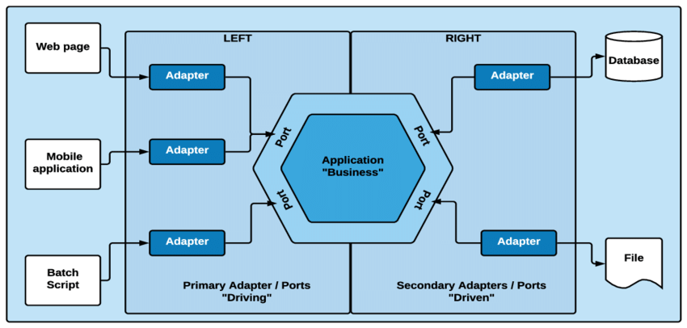

# Arquitetura Hexagonal - Meu Resumo

A arquitetura hexagonal, ou "Ports and Adapters", foi criada por **Alistair Cockburn** com o objetivo de deixar o código mais flexível, desacoplado e testável.

## 🧱 O que é a Arquitetura Hexagonal?



A ideia principal é dividir a aplicação em três camadas principais:

1️⃣ **Core (ou Domain)**: 
   - É o coração da aplicação. 
   - Contém as regras de negócio, sem depender de frameworks ou tecnologias externas. 

2️⃣ **Ports**: 
   - Interfaces que definem como a aplicação interage com o mundo exterior (entrada e saída).
   - Exemplo: Repositórios, serviços de mensageria, gateways HTTP, etc.

3️⃣ **Adapters**: 
   - Implementações das interfaces das Ports.
   - Exemplo: Controladores HTTP, implementações de persistência (JPA, JDBC), APIs externas.

✨ O segredo aqui é que o core não sabe nada sobre o mundo externo — apenas define o que precisa para funcionar.

---

## 🎯 Principais Benefícios

✅ **Desacoplamento total:** 
   - Você troca o banco de dados, o framework web ou até mesmo o sistema de mensageria sem mexer no core.

✅ **Testabilidade:** 
   - Como o core é isolado, fica mais fácil escrever testes unitários.

✅ **Flexibilidade:** 
   - Adicionar novas interfaces de entrada (ex: CLI, eventos, APIs REST) sem quebrar a lógica de negócio.

✅ **Manutenção:** 
   - Código mais limpo, organizado e fácil de entender.

---

## 📚 Casos de Uso

Essa arquitetura é ótima para:

- Aplicações com múltiplas interfaces (API REST, filas de mensagem, batch jobs).
- Projetos que precisam mudar de infraestrutura sem refatorar a lógica de negócio.
- Softwares com regras de negócio complexas que precisam ser isoladas.

---

## 🔧 Exemplo em Java

Exemplo simples de cadastro de produtos.

```java
// Dominio (Core)
public class Product {
    private String id;
    private String name;

    public Product(String id, String name) {
        this.id = id;
        this.name = name;
    }

    // Getters e setters
}

public interface ProductRepository {
    void save(Product product);
    Product findById(String id);
}

// Aplicação (Service)
public class ProductService {
    private final ProductRepository repository;

    public ProductService(ProductRepository repository) {
        this.repository = repository;
    }

    public void createProduct(String id, String name) {
        Product product = new Product(id, name);
        repository.save(product);
    }
}

// Infraestrutura (Adapter - implementação do repositório)
@Repository
public class JpaProductRepository implements ProductRepository {
    @Autowired
    private JpaRepository<Product, String> jpaRepository;

    @Override
    public void save(Product product) {
        jpaRepository.save(product);
    }

    @Override
    public Product findById(String id) {
        return jpaRepository.findById(id).orElse(null);
    }
}

// Adapter de entrada (Controller REST)
@RestController
@RequestMapping("/products")
public class ProductController {

    private final ProductService service;

    public ProductController(ProductService service) {
        this.service = service;
    }

    @PostMapping
    public ResponseEntity<Void> createProduct(@RequestBody Product product) {
        service.createProduct(product.getId(), product.getName());
        return ResponseEntity.ok().build();
    }
}
```

---

## 🔍 Conclusão

A arquitetura hexagonal ajuda muito na manutenção.

- Core independente de qualquer tecnologia externa.
- Facilidade de trocar as implementações sem mexer na regra de negócio.
- Testes mais fáceis e rápidos de implementar.

---

✨ **Fontes que me ajudaram:**
- Documentação do Spring Boot
- Artigos no Medium
- Vídeos no YouTube (Full Cycle, Fernanda Kipper, Rodrigo Branas)

